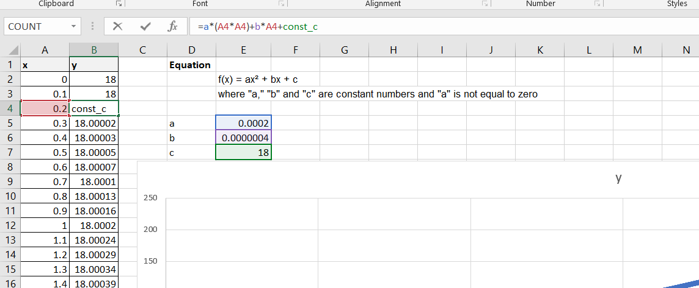
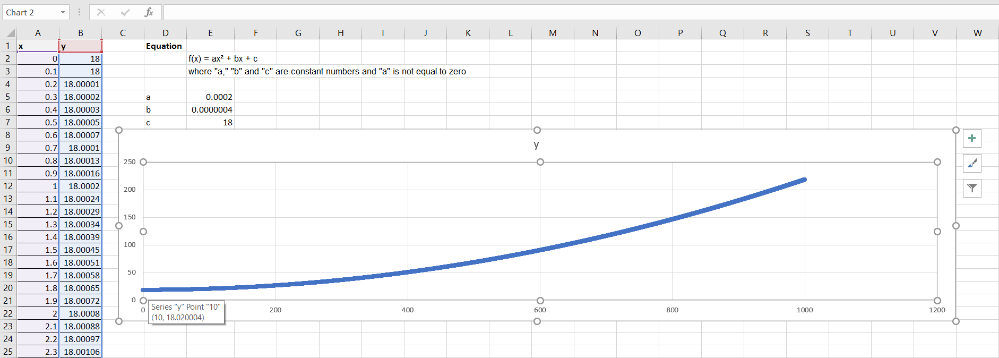
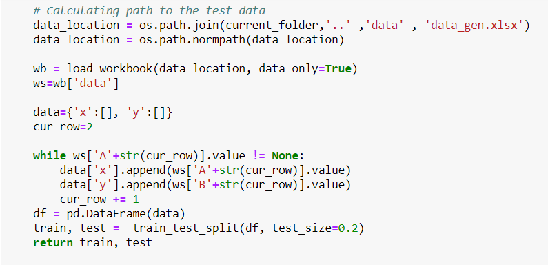
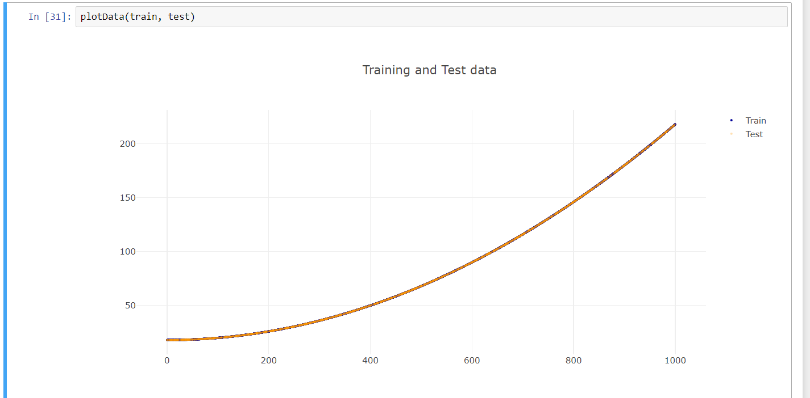
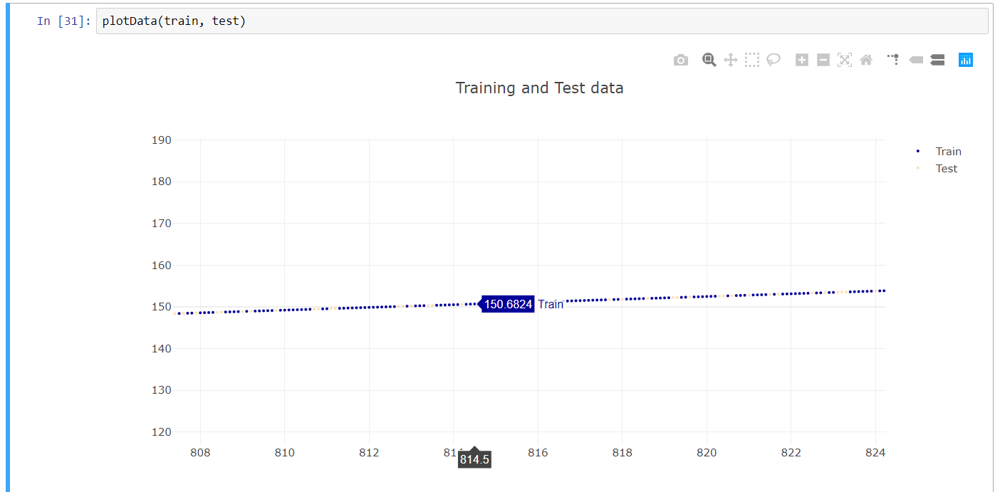
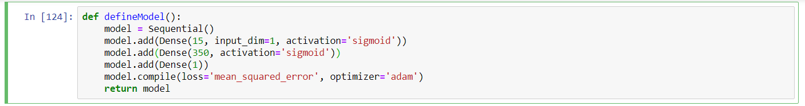
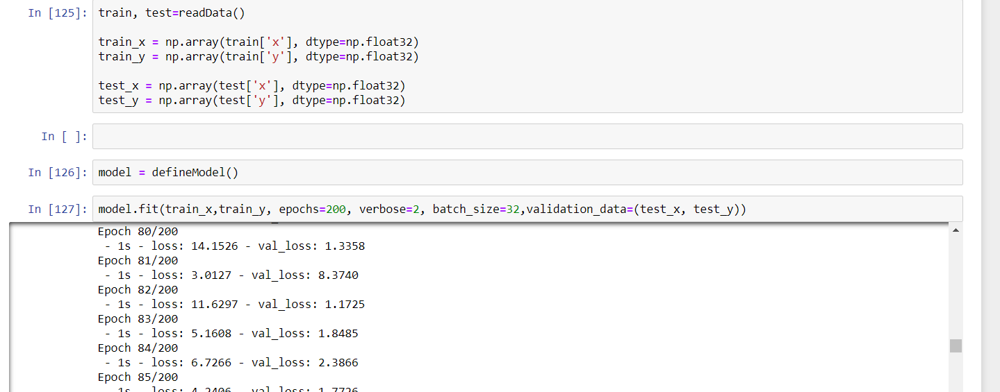
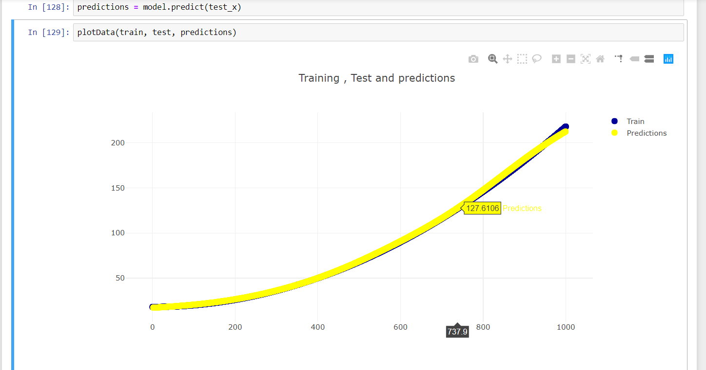

# Keras_Tutorial
Tutorial that demonstrates how to 
   
   1. Generate a curve in Excel
   2. Read and visualize the curve in Jyputer 
  3. Build and train a model to Fit the curve with Keras
  4. Plot output of the model 

#Installation of Python Modules 

pip3 install plotly openpyxl sklearn pandas keras ipynb

# Define curve in Excel

Curve is defined as a formula, this formula is evaluated for values of x to get curve

# Read data from Excel

Notebook "showData.ipnyb" demostrates how to read data from Excel and 
plot it with Plotly.

Zoom of plot to show test data (Test's color is kind of Orange)

#Train and visualize results

"trainAndRunModel" notebook has code for defining and training a model in Keras 

Model definiton:

Training:

This code 

1. Prepares data in input/output format of Neural network
2. Trains the network

Predictions from the Model and Visualization :

